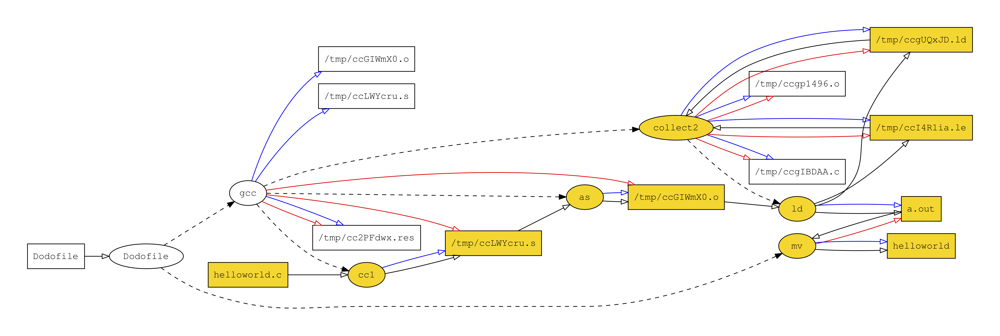

```
    .--.
.--/ *  \
(--._   |
 `   /  /_.----._  _
    /      __    \| )
   (       \-      (
    \_     /='     |
      \___    ____.'
          \ \/
          | |
         '" "`
```
# `dodo`: Fast and Precise Automatic Build Management

## Prerequisites

`dodo` currently only runs on Linux.

In order to build `dodo`, you will need to install `capnproto` and `libcapnp-dev` libraries.  On Ubuntu:

```
$ sudo apt install capnproto libcapnp-dev
```

`dodo` outputs dependency graphs in GraphViz format.  To install GraphViz on Ubuntu:

```
$ sudo apt install graphviz
```

## Building

To build `dodo`, you will need:

- A C++ compiler that supports C++14 or later
- The CapnProto data interchange tools
- The CapnProto C++ development library

On Ubuntu machines, install these with the following command.

```
sudo apt-get install build-essential capnproto libcapnp-dev
```

To build `dodo`, run
```
git submodule update --init
make
```

Some additional optional dependencies are:

- graphviz, for rendering build graphs
- cram, for running automated tests

To install these additional packages on Ubunutu, run:

```
sudo apt-get install graphviz python-cram
```

After building `dodo`, you can run the included automated tests with the command

```
make test
```

## Using `dodo`

`dodo` does not distinguish between building your project for the first time and rebuilding.  However, since developers need to do some initial setup when creating a new `dodo` project, we describe the two uses separately here.

### For the impatient

1. Create a `Dodofile`.
2. Run `dodo`.

### First build

We will demonstrate using `dodo` by way of example.  Here is a simple C program.

```
#include <stdio.h>

int main() {
  printf("Hello world!\n");
}
```

Create a `Dodofile` containing your build commands.  A `Dodofile` may be any executable file.  For example, it could be:

```
#!/bin/sh

gcc *.c
mv a.out helloworld
```

If your `Dodofile` is marked executable, `dodo` will run it using the interpreter you specify in your `#!` line. If `Dodofile` is not executable, `dodo` will run it with `/bin/sh`.

Assuming that `dodo` is in your path, run

```
dodo
```

### Rebuilds

To rebuild, run
```
dodo
```

Notice that this is exactly the same as the first use.

If you aren't convinced that `dodo` is working, try

```
rm helloworld
dodo
```

## GraphViz output

`dodo` can be configured to output the build dependence graph using the `--visualize` flag.  The file will be called `out.dot`, which can be rendered to PDF using the GraphViz `dot` command, e.g.  
```
$ dodo --visualize
$ dot -Tpdf out.dot >out.pdf
```

Here is a sample graph after changing `helloworld.c`.



Legend:

* Ellipses are commands and rectangles are files.
* Dashed arrows are parent-child relationships.
* <span style="color:red">Red</span> arrows mark when a command deletes a file.
* <span style="color:blue">Blue</span> arrows mark when a command creates a file.
* <span style="color:black">Black</span> arrows mark a read or write dependency.
* <span style="color:goldenrod">Golden-colored</span> items signify work done during an incremental build: golden commands are those being rerun, and golden files are those that were changed.